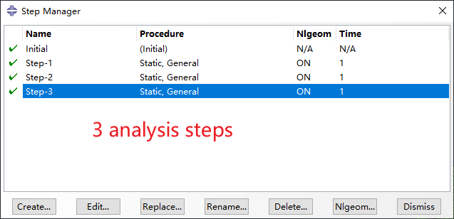
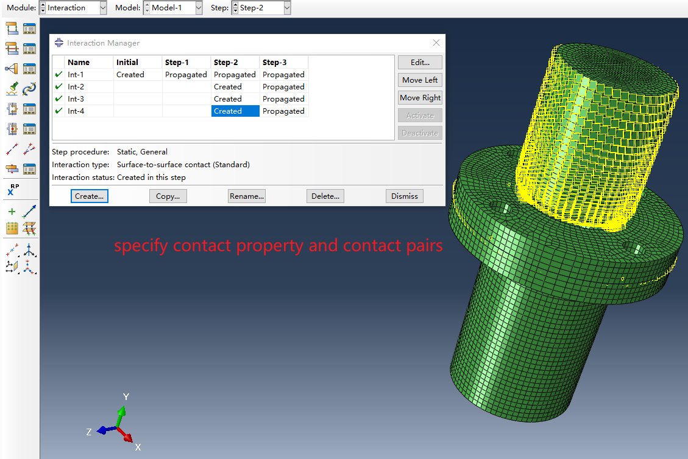
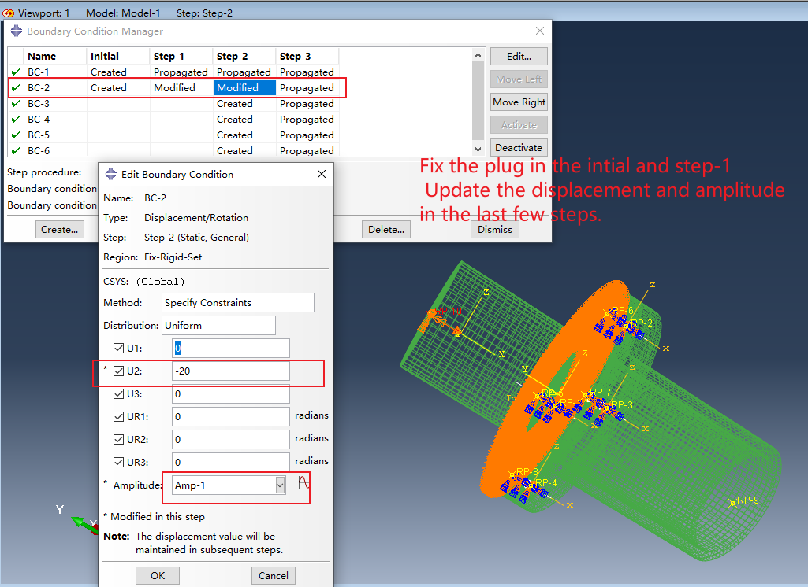

# 1.model information

## the whole model of flange

## the cross section of flange

**the model of flange was designed in the Creo.**
## the meshing information of model

**the mesh of model was meshed in Hypermesh.**
## the FEM model

the model of flange using the inp file was imported
## Model material properties were assigned
The flange is set to aluminum, the Young's modulus(E) is 7e4 MPa and the Poisson's ratio(v) is 0.33.

The plug is set to steel, the Young's modulus(E) is 2e5 MPa and the Poisson's ratio(v) is 0.3.

The property of rubber is set as shown in the following figure

The processing of simulation is divided into 3 steps,

step 1:apply pre-tightening force to the flange,

setp 2:insert the plug into the flange

setp 3:apply lateral to force to the flange

## build sets
Reference points and sets are built in the module of assembly, as shown in the following figure.

## Interaction

## load conditions

## post processing

1.Results are displacement 20mm for the plug

2.Results are displacement 6mm for the plug

